# Innovation Governance Hub

[](https://github.com/Daniel-Macedo-dev/innovation-governance-hub/actions/workflows/ci.yml)

> Este projeto utiliza exclusivamente dados fictícios e foi desenvolvido para fins educacionais e de portfólio. Não representa processos, políticas, resultados ou informações internas de nenhuma empresa real.

Aplicação local multipage para demonstrar gestão de iniciativas, gates, governança de IA, orçamento, reuniões, documentos, Excel e automações na empresa fictícia **Horizonte Operações Integradas**.

## O que este projeto demonstra

Gestão de portfólio e gates, governança responsável de IA, priorização com pesos explícitos, indicadores de resultado, controle orçamentário, interoperabilidade com Excel, automações desacopladas, arquitetura em serviços, testes automatizados e documentação de decisões e limitações.

## O que a aplicação permite decidir

O **Comitê de Inovação** consolida o que requer decisão, a saúde explicável do portfólio, pendências, mudanças recentes, projeção financeira, governança de IA e indicadores. Recomendações são determinísticas e nunca substituem aprovação humana.

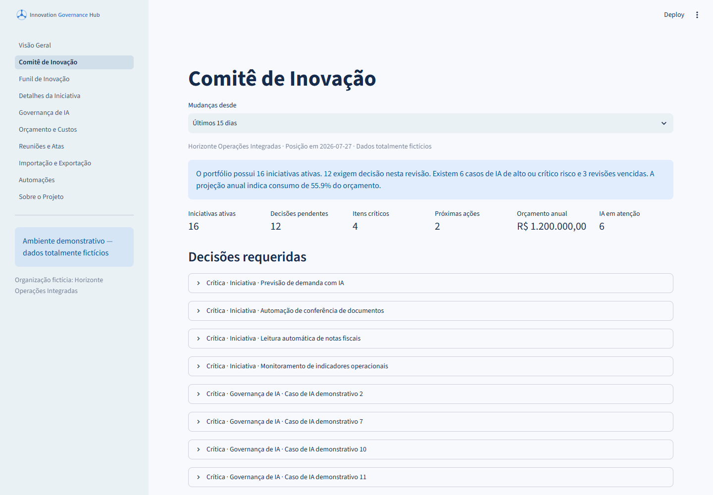

## Demonstração visual

| Priorização e indicadores | Dashboard executivo |
| --- | --- |
| 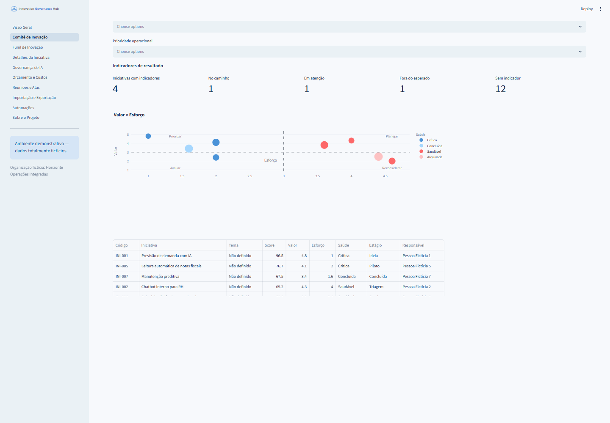 | 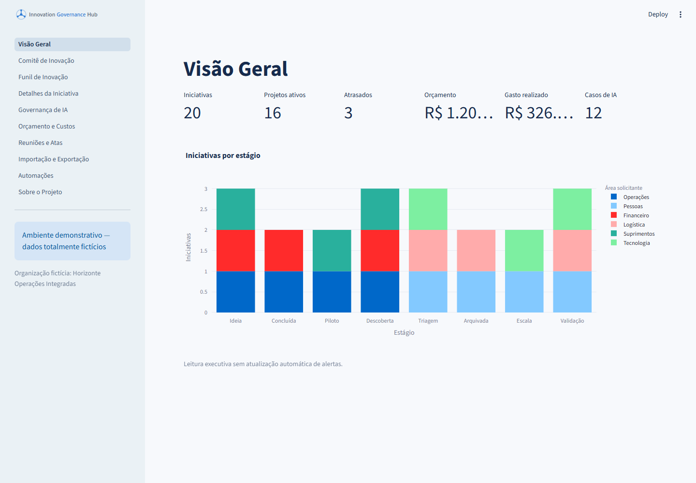 |

| Funil de inovação | Governança de IA |
| --- | --- |
| 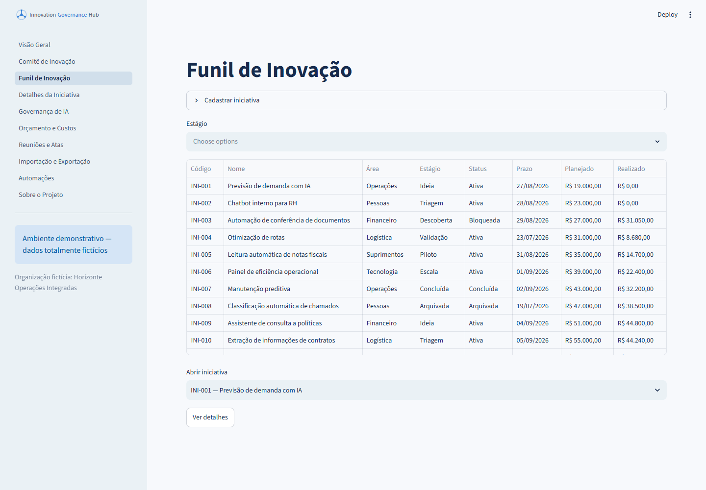 | 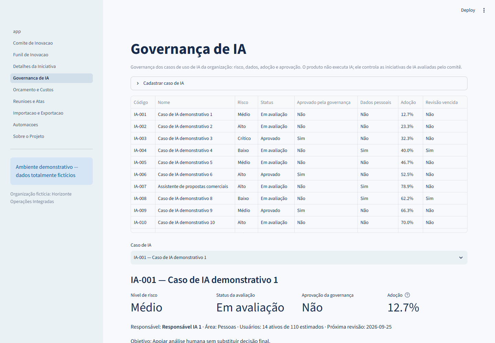 |
| Gate bloqueado | Timeline da iniciativa |
| 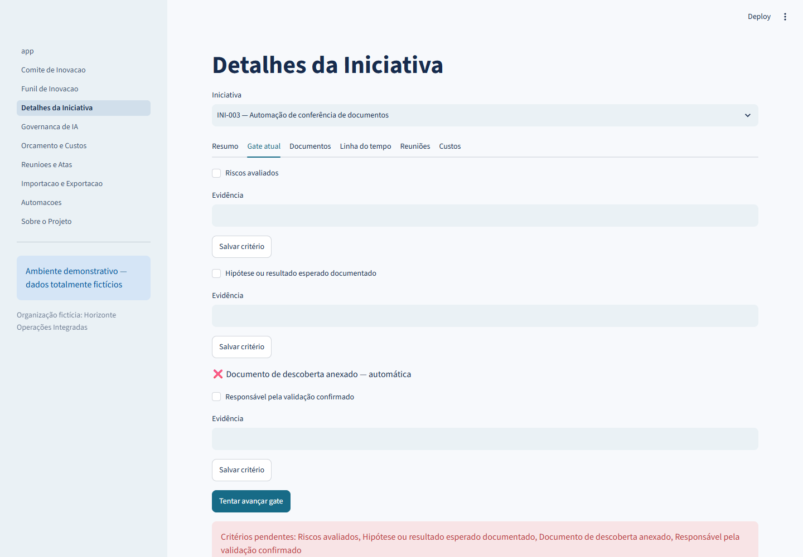 | 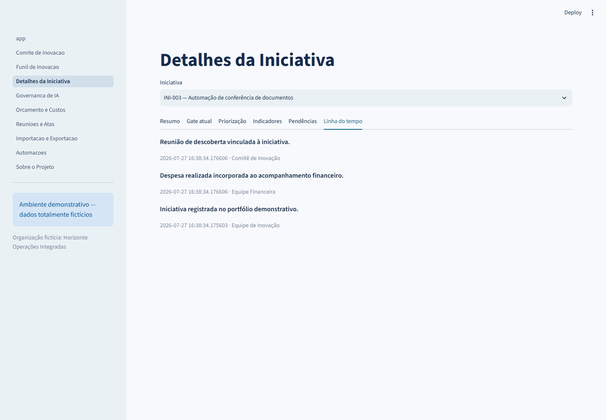 |
| Orçamento e projeção | Reunião e resumo local |
| 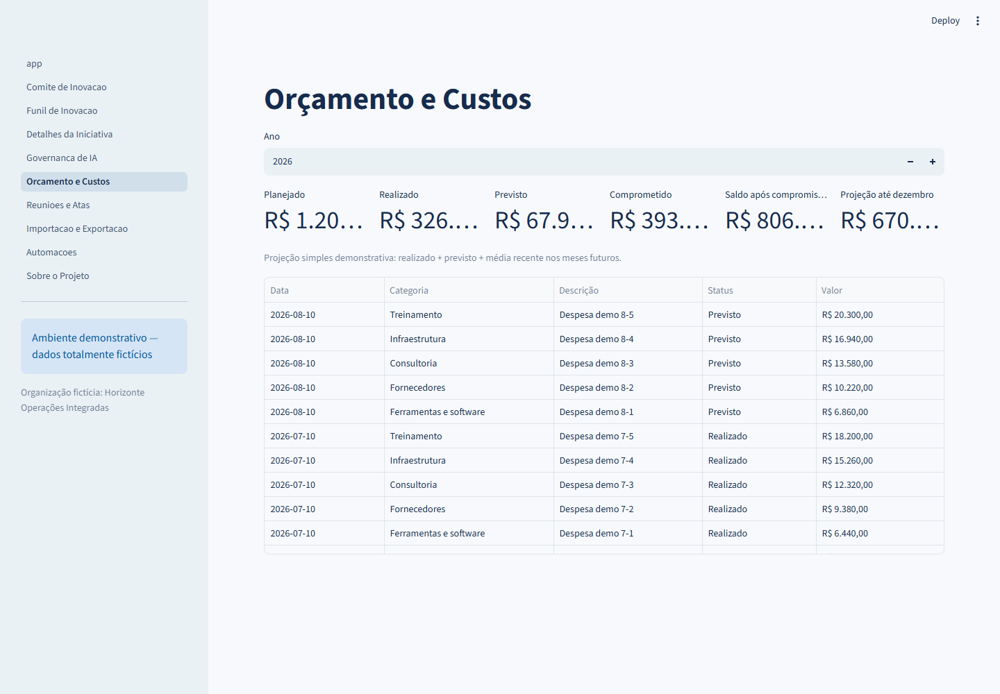 | 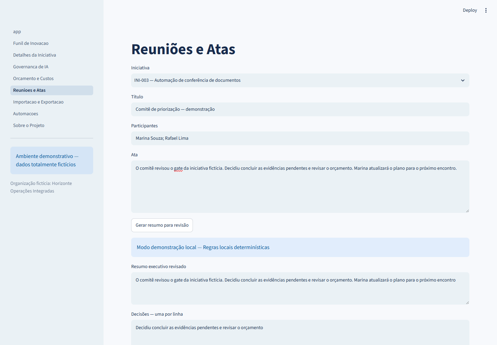 |
| Importação Excel | Automações e alertas |
| 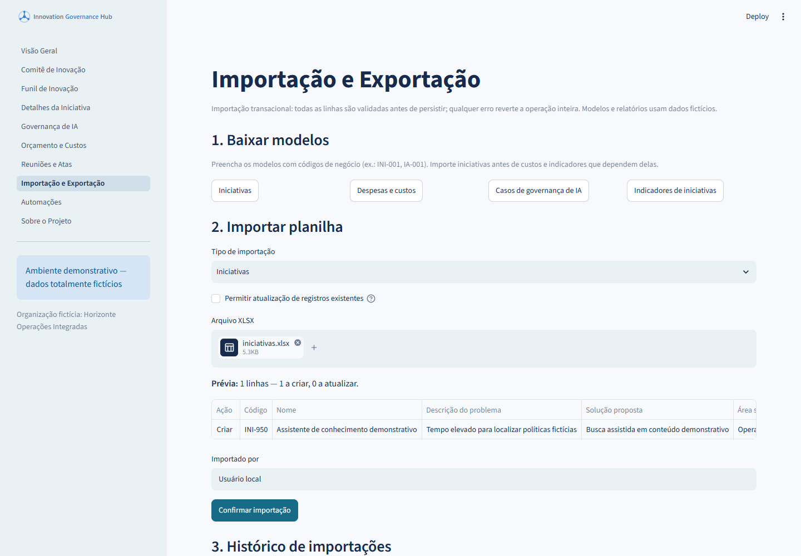 | 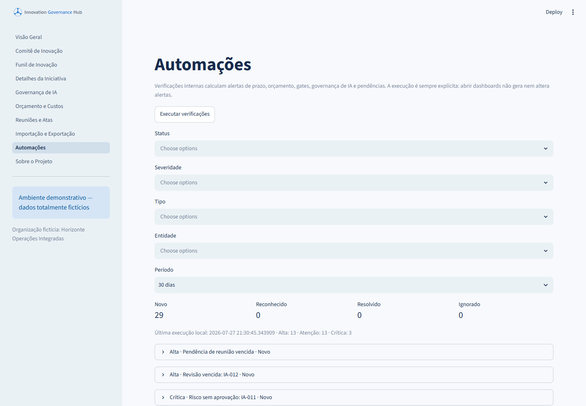 |

As imagens são capturas automatizadas da aplicação Streamlit real. Consulte [como reproduzir as capturas](docs/screenshots/README.md).

## Funcionalidades

- Dashboard executivo com indicadores, gráficos e listas de atenção.
- Funil sequencial com critérios automáticos, manuais e aprovações; tentativas bloqueadas são auditadas.
- Documentos locais, reuniões e linha do tempo imutável de eventos relevantes.
- Casos de IA com histórico decisório, justificativas, restrições e próxima revisão.
- Orçamento em `Decimal`, compromissos, variação e projeção simples até dezembro.
- Importação transacional com fingerprint contra reprocessamento.
- Alertas com reconhecimento, resolução, descarte justificado e reabertura auditada.
- Pacote executivo Excel com dez abas, gerado em memória a partir da mesma leitura do Comitê.

A priorização combina critérios explícitos de valor e esforço, preserva a prioridade operacional e posiciona as iniciativas em quatro quadrantes. Indicadores registram baseline, valor atual, meta, direção, responsável e data de medição; seus estados são calculados e explicados na interface.

## Stack e arquitetura

Python 3.11+, Streamlit, FastAPI, SQLAlchemy 2/SQLite, Pandas, Plotly, openpyxl, Pydantic, HTTPX, Pytest, Ruff e Mypy. O fluxo é `UI → serviços → persistência → SQLite`; integrações dependem de adaptadores. Veja [arquitetura](docs/architecture.md).

## Instalação e execução local

```powershell
python -m venv .venv
.\.venv\Scripts\Activate.ps1
python -m pip install -e ".[dev]"
python -m scripts.init_db
python -m scripts.seed_demo
python -m scripts.generate_excel_templates
streamlit run app.py
```

### Demonstração reproduzível para entrevista

```powershell
python -m scripts.prepare_interview_demo
python -m scripts.run_interview_demo
```

Esse modo usa somente `data/interview_demo.db`, data de negócio fixa em `2026-07-27`, IA local demonstrativa e n8n desligado. Não altera `.env` nem o banco principal.

API em outro terminal:

```powershell
.\.venv\Scripts\Activate.ps1
uvicorn api:app --host 127.0.0.1 --port 8000
```

Use `Authorization: Bearer change-me-local` nos endpoints de escrita e altere o token em `.env`. Exemplos:

```powershell
curl.exe http://127.0.0.1:8000/health
curl.exe -X POST http://127.0.0.1:8000/api/v1/automations/run -H "Authorization: Bearer change-me-local" -H "Content-Type: application/json" -d '{"dispatch_n8n":false}'
```

## Configuração

Copie `.env.example` para `.env`. A aplicação não utiliza IA generativa: atas e resumos executivos de reunião são registrados manualmente. A governança de **casos de uso de IA** é uma área de negócio do produto — cadastrar, avaliar e aprovar iniciativas de IA da organização — e não depende de nenhum provedor externo.

### Possíveis integrações futuras

O diretório `n8n/` guarda uma prova de conceito isolada de encaminhamento externo de alertas. Ela não faz parte do fluxo principal: a aplicação funciona integralmente sem n8n, Docker ou credenciais externas, e a interface nunca chama webhooks. Detalhes em `n8n/README.md`.

## Operação e qualidade

```powershell
python -m scripts.run_automation_checks
python -m scripts.validate_excel_roundtrip
python -m scripts.validate_project
ruff check .
ruff format --check .
mypy src
pytest --cov=src/innovation_governance_hub/services --cov=src/innovation_governance_hub/domain --cov-report=term-missing
docker compose config
docker compose up --build app api
```

Capturas locais opcionais, sem adicionar navegador às dependências de produção ou ao CI:

```powershell
python -m pip install -e ".[dev,screenshots]"
python -m scripts.capture_screenshots
```

Na página Excel, baixe modelos gerados por código, escolha iniciativas ou custos, valide a planilha, revise a prévia e confirme a transação. Linhas inválidas impedem toda a persistência e produzem relatório XLSX de erros. O MVP não usa locale global e apresenta moeda/data em pt-BR.

## Métricas, estrutura e limitações

Definições completas estão em `docs/metric-definitions.md`. Código principal em `src/innovation_governance_hub`, páginas em `pages`, comandos em `scripts`, testes em `tests`, documentação em `docs` e workflow em `n8n`.

MVP local individual, sem autenticação/RBAC, migrations Alembic ou armazenamento em nuvem. SQLite/WAL é adequado à demonstração, não a alta concorrência. O seed é idempotente por códigos e descrições estáveis e não destrói alterações existentes. Casos de IA, iniciativas, despesas, documentos, reuniões e pendências possuem operações locais; exclusões destrutivas exigem confirmação na UI. Próximos passos não essenciais: autenticação, migrations e armazenamento externo.

Licença MIT; consulte `LICENSE`.

Documentação complementar: [estudo de caso](docs/presentation/project-case-study.md), [guia de demonstração](docs/presentation/manager-demo-guide.md), [decisões técnicas](docs/presentation/technical-decisions.md) e [limitações](docs/presentation/limitations-and-next-steps.md).
